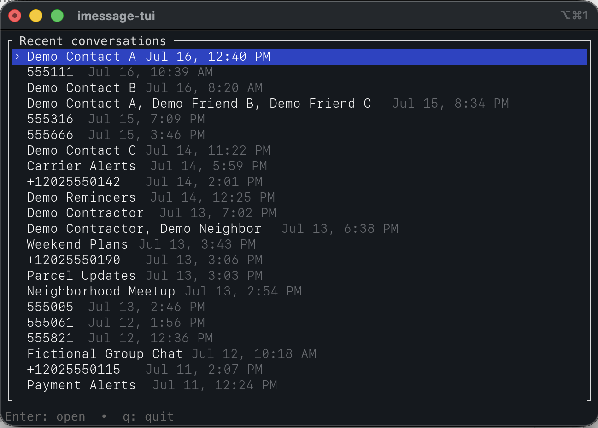

# imessage-tui

A local, read-only terminal browser and Markdown exporter for the macOS Messages database.



_Screenshot uses fictional conversation labels._

## V1 features

- Lists recent conversations newest first.
- Resolves contact names from the local macOS Contacts database when possible.
- Opens a conversation at its latest 20 messages and pages older messages on demand.
- Exports one conversation to Markdown for the last hour, last 24 hours, a custom number of hours or days, or all time.
- Defaults export paths to the directory where `imessage-tui` was started.
- Preserves message timestamps and sender names, and includes reactions and attachment placeholders.

## Requirements

- macOS with Messages data stored locally.
- Full Disk Access for the terminal application that launches `imessage-tui`.
- Rust is required only when building from source.

## Install from source

Rust is required to install from source. After cloning this repository, run:

```sh
cargo install --path .
```

This builds and installs `imessage-tui` in Cargo's binary directory, which is
usually `~/.cargo/bin`. Start it with:

```sh
imessage-tui
```

## Build without installing

```sh
cargo build --release
./target/release/imessage-tui
```

## Keys

### Conversations

- `↑` / `↓` or `j` / `k`: move
- `Page Up` / `Page Down`: move faster
- `Enter`: open conversation
- `q`: quit

### Messages

- `↑` / `↓` or `j` / `k`: older/newer message
- `Page Up` / `Page Down`: jump ten messages
- `Home` / `End`: oldest/latest loaded message
- `e`: export
- `q`, `Esc`, or `Backspace`: return to conversations

## Privacy

The Messages and Contacts databases are opened read-only. Exports are ordinary unencrypted Markdown files, so store them appropriately.

## V1 limitations

- Keyboard navigation only; no mouse support.
- Attachment files are not copied. Markdown contains placeholders.

## License

MIT. See [LICENSE](LICENSE).
