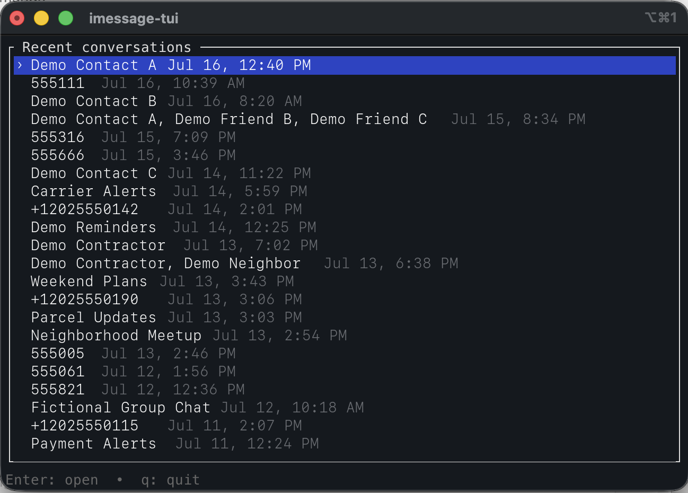
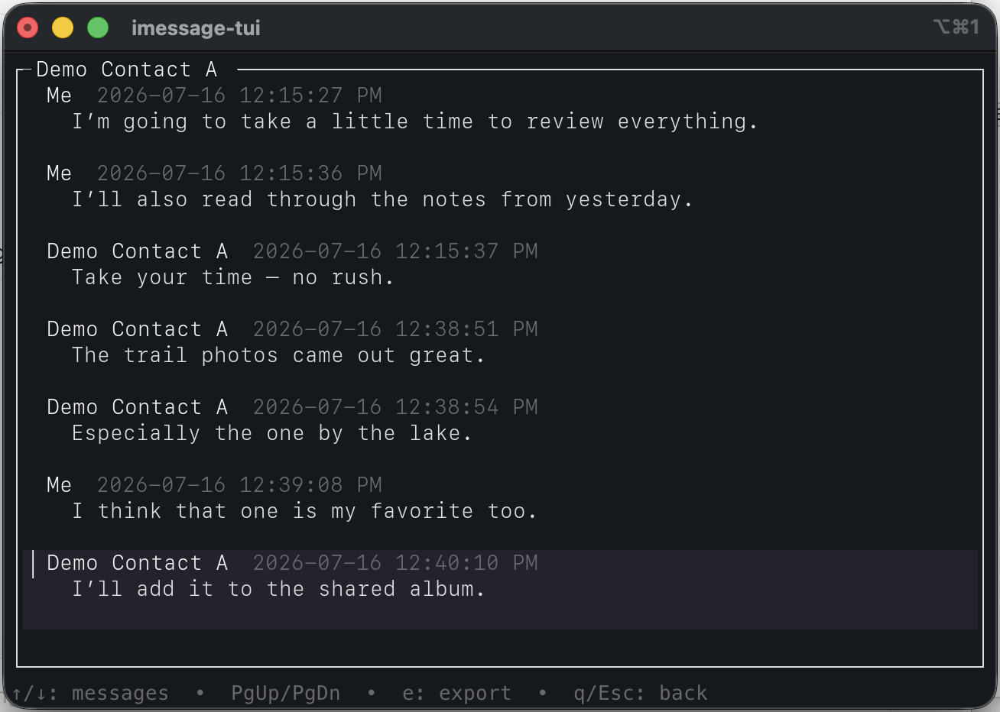
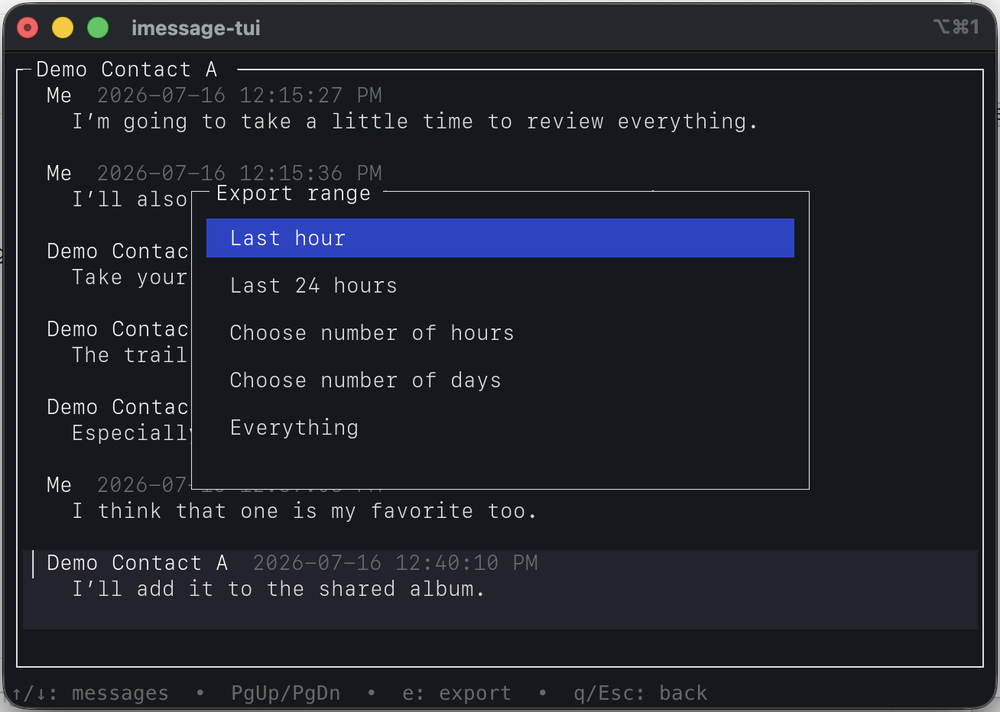
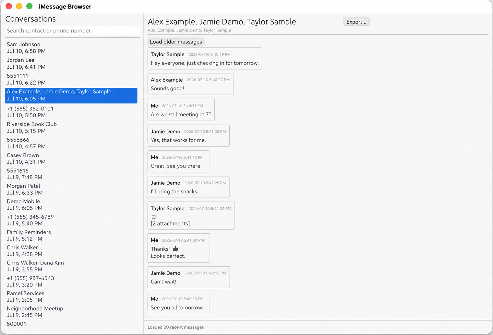

# imessage-tui

A private-by-default, read-only browser and Markdown exporter for Messages data stored on your Mac.

<p align="center">
  
</p>

## Project status

The current version is `0.1.2`. GitHub releases are source-only; no prebuilt binary is currently distributed. Version 0.1.2 adds safer default export directories and the unsigned GUI prototype while keeping the TUI as the primary interface.

The GUI is a local Apple Silicon experiment, not a supported or signed application release. The TUI remains the primary interface.

## What it does

- Lists recent Messages conversations newest first.
- Resolves names from the local Contacts database when possible.
- Searches conversations by contact name or phone number.
- Opens the latest 20 messages and loads older pages on demand.
- Exports one conversation for the last hour, last 24 hours, a custom number of hours or days, or all time.
- Preserves timestamps and sender names and represents reactions and attachments in Markdown.
- Opens the Messages and Contacts databases read-only and performs no network requests.

## Requirements

- macOS with Messages data downloaded locally
- Full Disk Access for the terminal application that launches `imessage-tui`
- A current stable Rust toolchain for installation; the project does not yet declare a minimum supported Rust version

## Install the current source

Clone the repository and install the locked dependency set:

```sh
git clone https://github.com/rsheyd/imessage-tui.git
cd imessage-tui
cargo install --locked --path .
```

Cargo normally installs the binary at `~/.cargo/bin/imessage-tui`. If that directory is not on your `PATH`, either add it or start the binary with its full path.

To install the latest published release rather than current development:

```sh
cargo install --locked --git https://github.com/rsheyd/imessage-tui.git --tag v0.1.2
```

## Grant Full Disk Access

macOS protects the Messages and Contacts databases. Grant Full Disk Access to the application that hosts the process—not to the `imessage-tui` executable itself.

1. Open **System Settings → Privacy & Security → Full Disk Access**.
2. Add and enable the terminal you use, such as Terminal, iTerm2, Warp, or Ghostty. If you use `tmux`, grant access to the terminal application hosting the session.
3. Quit that terminal application completely and reopen it.
4. Start `imessage-tui` again.

Only grant this permission to terminal applications you trust. Full Disk Access applies to the entire terminal application, not just this program.

## Use the TUI

Start the installed binary from the directory where you want its ignored `exports/` subdirectory:

```sh
imessage-tui
```

Essential controls:

| Context | Key | Action |
|---------|-----|--------|
| Conversations | `↑` / `↓` or `j` / `k` | Move between conversations |
| Conversations | `Page Up` / `Page Down` | Move faster |
| Conversations | `/` | Search names and phone numbers; `Esc` clears the search |
| Conversations | `Enter` | Open the selected conversation |
| Messages | `↑` / `↓` or `j` / `k` | Move between loaded messages |
| Messages | `Page Up` / `Page Down` | Jump ten messages and load older pages as needed |
| Messages | `Home` / `End` | Move to the oldest or latest loaded message |
| Messages | `e` | Choose an export range and path |
| Messages | `q`, `Esc`, or `Backspace` | Return to conversations |
| Anywhere | `q` | Quit from the conversation list |

## Markdown exports

The default TUI path is `./exports/<conversation>-<range>-<date>.md`, relative to the directory where the program was started. The directory is created automatically. When the TUI is launched from this repository, `/exports/` is ignored by Git to reduce the risk of committing private conversations accidentally.

The export prompt remains editable, so you can choose another relative or absolute destination. Exports written outside this repository are not covered by its `.gitignore` rule.

Export files are ordinary, unencrypted Markdown containing names, participant identifiers, timestamps, message text, reactions, and attachment placeholders. Treat them as sensitive personal data: review paths before exporting, avoid cloud-synchronized or shared directories unless intended, and inspect files before attaching them to bug reports or AI tools.

<p align="center">
  
  
</p>

## GUI prototype

The repository also contains an unsigned Apple Silicon macOS prototype named **iMessage Browser**. It shares the read-only database and export code with the TUI and provides conversation search, paging, and the same export ranges.

Build it locally with:

```sh
./scripts/build-app.sh
open "dist/iMessage Browser.app"
```

The prototype requires macOS 12 or later and Full Disk Access for `dist/iMessage Browser.app`. Add that app bundle in **System Settings → Privacy & Security → Full Disk Access**, enable it, then quit and reopen it. Its default export directory is `~/Documents/iMessage Exports/`.

The app is unsigned, has no published binary, and is intended only for local testing. Gatekeeper behavior, permissions, and architecture compatibility may differ from a future distributed application.

<p align="center">
  
</p>

## Privacy and limitations

- Messages and Contacts databases are opened read-only.
- The application does not transmit Messages or Contacts data over the network.
- Exported Markdown is unencrypted and leaves macOS-protected database storage.
- Attachments are not copied; exports contain placeholders rather than attachment contents.
- Contact resolution depends on locally available Contacts data and may fall back to an address or phone number.
- The project does not modify, send, delete, or synchronize Messages.

## Development

Build without installing:

```sh
cargo build --locked --release
./target/release/imessage-tui
```

Before contributing, see [CONTRIBUTING.md](CONTRIBUTING.md). User-visible changes are recorded in [CHANGELOG.md](CHANGELOG.md), and the current manual acceptance checklist is maintained in [PROJECT-STATUS.md](PROJECT-STATUS.md).

## License

imessage-tui is available under the [MIT License](LICENSE).
